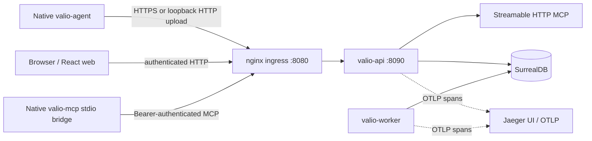
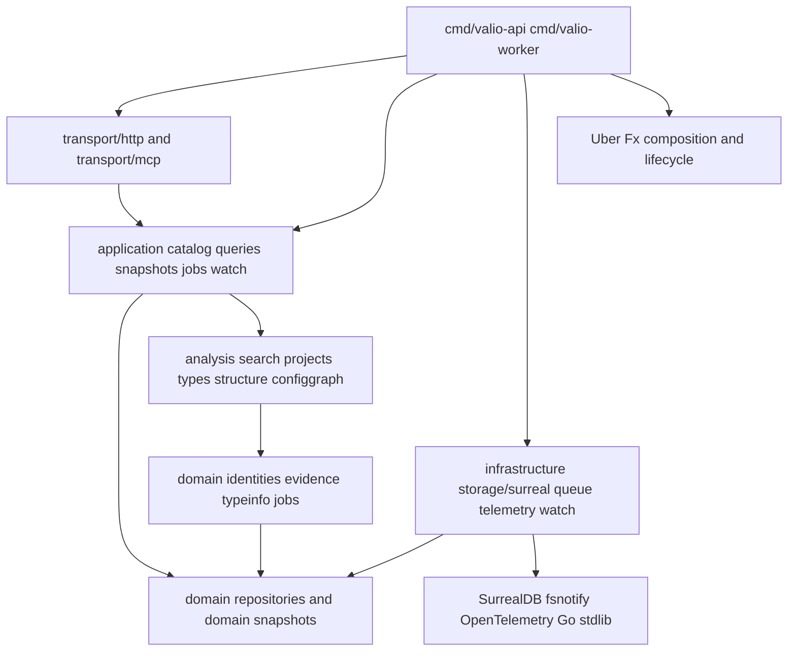
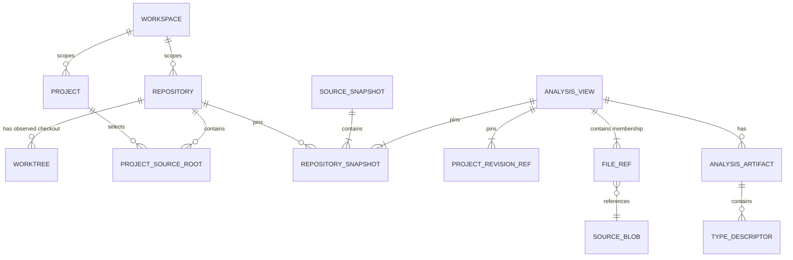
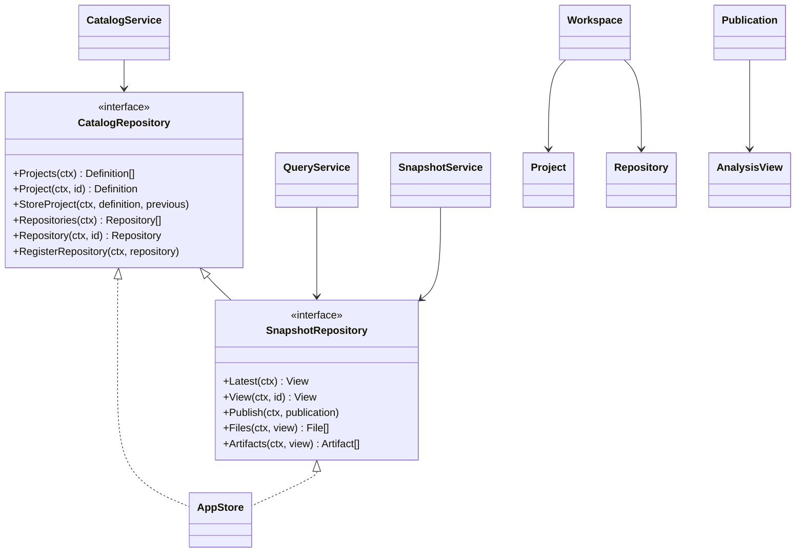
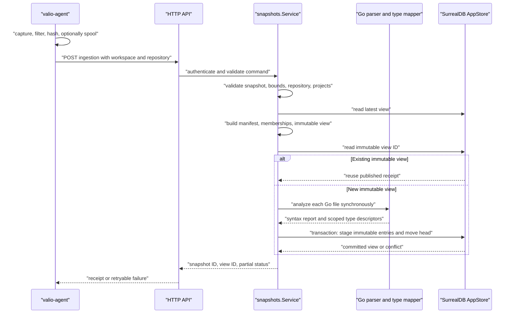
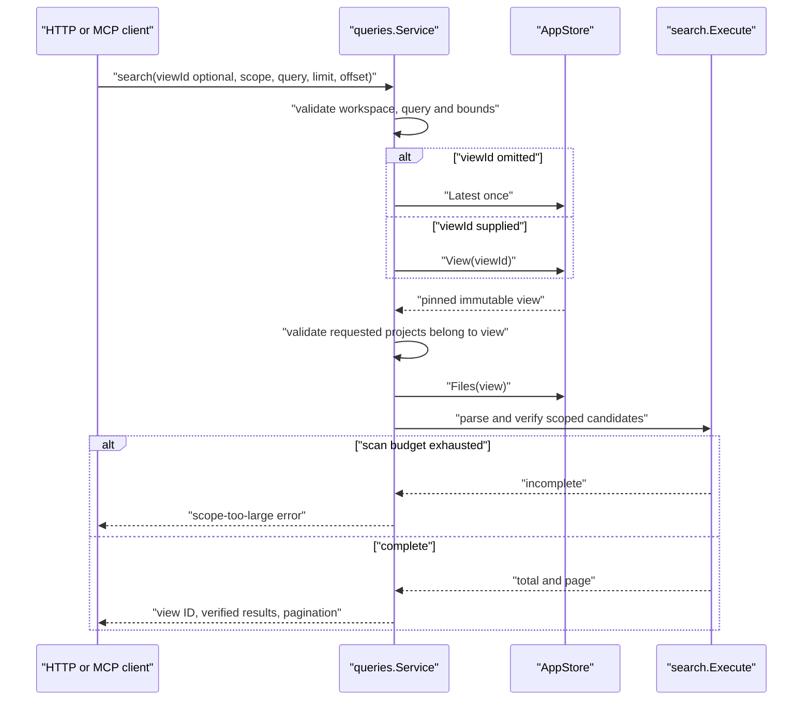
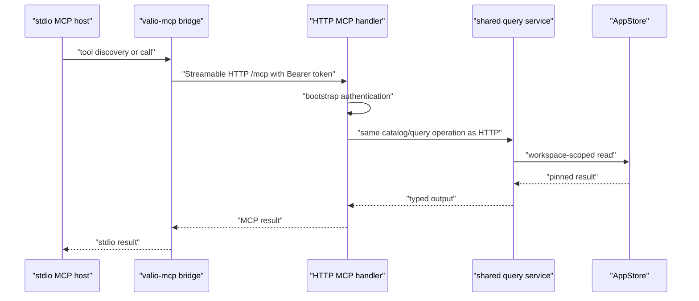
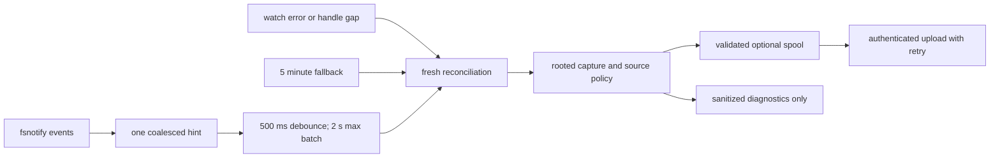
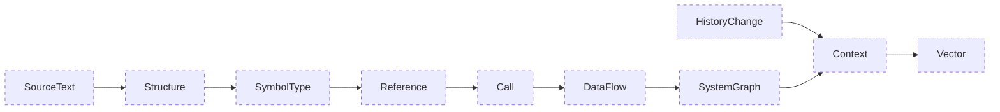

# Architecture and component boundaries

This document describes the running local vertical slice in this repository. It also marks the intended boundaries that are not yet running. A package, interface, or projection contract is not evidence that its planned producer is implemented.

## Current system context

`valio.code` is a single Go module rooted at [`src/back-end`](../../../src/back-end), with native command binaries, a React/Vite application in [`src/front-end`](../../../src/front-end), and SurrealDB as the only persistent application store. A Project is a service, library, application, or tool; a Workspace is an access boundary; a Repository is a configured source remote; and a Worktree is an observed local checkout. They are deliberately distinct. A project can span repositories and multiple projects can share a root.

Compose exposes only the web ingress on loopback `127.0.0.1:8080` and Jaeger on `127.0.0.1:16686`. The API listens on `8090` inside the backend network. SurrealDB is internal to Compose; native integration testing uses a separate test overlay that exposes loopback port `18000`. Compose runs the local example namespace/database `valio` / `workspace_main` with one shared `root` / `valio` database configuration for migrate, API, and worker. This is deliberately local development configuration, not separately provisioned service users. Jaeger has no persistent volume, so its trace storage is ephemeral.

The API bootstraps one configured local workspace (`workspace-main`). The domain supports workspace-scoped identities and multiple repositories/project roots; it does not implement multi-user roles or multi-tenant control-plane provisioning.

## Dependency direction and composition

The dependency direction is inward. Domain packages do not import HTTP, SurrealDB, Fx, filesystem or compiler SDKs. Application services depend on typed domain ports. Infrastructure implements ports and owns I/O. Transports adapt HTTP and MCP to the same application services. Command packages are composition roots, not business-logic homes.

[`cmd/valio-api/module.go`](../../../src/back-end/cmd/valio-api/module.go) constructs one `surreal.Client`, workspace-scoped `surreal.AppStore`, catalog/query/ingestion services, bootstrap authorization, HTTP adapter and MCP server with Fx. The HTTP and MCP adapters receive the same store/query services. [`cmd/valio-worker/module.go`](../../../src/back-end/cmd/valio-worker/module.go) separately composes a queue-backed worker with concurrency two. Its only registered processor is `health`, which pings SurrealDB. No asynchronous analysis processor is wired; source analysis occurs synchronously during ingestion.

Use interfaces at actual boundaries: persistence ports, provider implementations, filesystem/change sources, compiler providers, and job processors. Do not create a Go interface, factory, visitor, or “manager” merely to wrap a concrete domain value. Focused structs with methods and package-level functions are the preferred shape for pure validation, mapping, parsing, graph algorithms and builders.

## Domain model and immutable views

The many-to-many source-root relation is intentional. Roots carry repository, relative path, include/exclude globs, role, build unit and version. Membership is resolved at publication, copied into the immutable view, and never recomputed from a later project edit.

Important invariants come from [`domain/model.go`](../../../src/back-end/internal/domain/model.go), [`projects/definition.go`](../../../src/back-end/internal/projects/definition.go), and [`domain/snapshots`](../../../src/back-end/internal/domain/snapshots):

- Project ID, workspace, and key are immutable across updates. A source root must have a repository and version; include/exclude patterns are rooted, clean and validated.
- A repository snapshot pins a manifest fingerprint, not a mutable branch name. A view pins project definitions/revisions, repository snapshots, source files and their memberships. Mixed repository snapshots are marked explicitly.
- Evidence belongs to a view and has origin, assertion, resolution, repository-relative half-open range, and explicit UTF-8/UTF-16 position encoding.
- Type identity includes workspace, project, build profile and view version. Unknown layout, reference resolution, or other compiler facts stay unknown; they are never represented as zero or guessed exact.

The following class diagram uses the actual Go ports and service structs, rather than inventing an object-oriented layer.

## Ingestion and atomic publication

The native agent captures a sanitized content-addressed snapshot. Path policy excludes unsafe paths, symlinks, nonregular files, sensitive names and oversized files before content I/O. After a safe read, binary/non-UTF-8 checks, configuration projection and suspected-credential filtering run before content hashing, spool write or upload. Configuration formats become safe key-only projections; values never enter the snapshot source content. Spool is a retry journal, not a searchable second database.

[`snapshots.Service.Ingest`](../../../src/back-end/internal/application/snapshots/service.go) validates untrusted input before repository access or hashing, bounds input at 10,000 files and 16 MiB, resolves project membership, and creates artifacts only for Go files. It checks whether the deterministic view already exists before parsing artifacts or publishing, so an exact retry reuses the existing receipt. Server ingestion invokes `analysis.Analyze`, so it collects syntax facts; it does not enable the optional one-file `go/types` check. [`surreal.AppStore.Publish`](../../../src/back-end/internal/infrastructure/storage/surreal/app_publication.go) verifies the expected head and current project definitions in one transaction, accepts a pre-existing immutable record only when its stored payload compares equal, and moves the latest-view pointer only with all staged records. A concurrent publish or project edit produces a conflict instead of a partial view. Expensive capture and analysis happen before that transaction.

## Reads are pinned and verified

The query service resolves an omitted view ID to `latest` once, then uses that concrete view throughout a request. It checks workspace scope and view membership before reading source/artifacts. Search reconstructs an in-memory candidate source from persisted files, parses the text expression, verifies candidates against source, and fails when scan limits prevent complete results. It is not persistent FTS/HNSW and it is not semantic retrieval.

`Search` accepts at most 8,192 query bytes, 1,000 result limit, nonnegative offset and 128 project IDs. It verifies no more than 10,000 files/16 MiB in this deployment. `Types` reads only artifacts in the pinned view and constructs a scoped catalog; ambiguous type candidates remain distinct. The implemented MCP tools are `project_list`, `project_get`, `code_search`, `type_query`, and `index_status`. No graph tool is advertised.

## HTTP, MCP and local authorization

The HTTP adapter and Streamable HTTP MCP server use shared application operations. The native `valio-mcp` binary is not a second database client: it discovers remote tools, forwards their arguments, attaches a bearer token, rejects redirects, and permits non-HTTPS only for loopback. The API performs validation, authorization and view resolution.

The local bootstrap authenticator stores only a token hash and creates an ephemeral session-signing key at startup. Browser sessions are HttpOnly, SameSite Strict cookies with an eight-hour lifetime; bearer requests are accepted for native clients. Unsafe cookie-authenticated requests require an allowed origin. This is deliberately a local bootstrap principal, not role-based access control.

## Durable jobs and fencing

Jobs are durable, at-least-once records in SurrealDB. Claims are transactional and give a worker slot an owner, increasing fence token, attempt count and 60-second lease. Heartbeat, completion, failure and projection publication check the live owner/fence/lease before mutation. A stale worker cannot complete or publish after cancellation or lease loss.

```mermaid
stateDiagram-v2
  [*] --> queued: "enqueue or temporary retry"
  queued --> running: "transactional claim; fence plus one"
  running --> running: "heartbeat extends lease"
  running --> completed: "complete or fenced publish"
  running --> queued: "temporary failure; exponential delay"
  running --> failed: "permanent or retries exhausted"
  queued --> cancelled: "cancel"
  running --> cancelled: "cancel increments fence"
  running --> queued: "lease expires; another claim"
  completed --> [*]
  failed --> [*]
  cancelled --> [*]
```

The supported implementation transitions are in [`infrastructure/queue`](../../../src/back-end/internal/infrastructure/queue). The worker maps an unknown job kind to permanent `UNSUPPORTED_JOB`, and processor failure to temporary `HANDLER_FAILED` retry while attempts are at most five. Although the queue can atomically publish a generation head under a lease, no analysis/projection job producer is currently registered; the local worker runs only the `health` processor.

## Watching, reconciliation and source policy

`fsnotify` is a hint source. It recursively watches ordinary directories without following symlinks, skips `.git`, `.valio`, `.tools` and `node_modules`, and enforces an 8,192-handle budget. It does not read file contents. The watch service coalesces signals, debounces for 500 ms, caps a batch at two seconds, reconciles immediately after a notification gap, and also reconciles every five minutes. Full capture/policy remains the authority.

Do not treat a watcher event as a file mutation record, or assume that a quiet watcher proves a current index. Do not log source payloads, query text, credentials or configuration values at application/infrastructure boundaries. Keep path policy before reads and content/config filtering before hashing, spool and upload. If a new format can expose secrets, exclude it until a safe parser/projection exists.

## Proposed profiles and projections are not yet implemented

The repository contains a projection-family registry and several rich contracts. They are useful planning constraints, not running graph or vector features. In particular, no persistent graph projection, call/CFG/data-flow producer, vector/HNSW index, semantic context generation, five-language SCIP pipeline, history analytics, API/SQL/event linker, or asynchronous analysis worker exists today.

The dashed diagram is **proposed contract topology**, taken from the registry, not a runtime data flow. Its profiles must eventually include producer/version, source/build inputs, schema, evidence/completeness, output fingerprint, invalidation scope and cost limits. Selecting a profile must never weaken source policy or permit content that capture would exclude. It must be integrated with immutable views before any graph result is exposed. The current ingestion view only exposes source text as ready and symbols/types as partial; the server-side Go analysis remains synchronous and syntax-led.

## Extension guide

Use this routing when adding a capability:

| Change | Put it in | Required work |
|---|---|---|
| Identity, invariant, evidence, durable value or repository port | `internal/domain`, `internal/domain/typeinfo`, `internal/domain/snapshots`, `internal/domain/repositories` | Validation and GoDoc; no HTTP, SurrealDB, Fx, compiler SDK or SQL imports. |
| Command/query behavior, authorization-independent scope checks, bounded orchestration | `internal/application/<feature>` | Explicit input/output, typed port, cancellation/budget behavior, focused unit tests. |
| Parsing, pure analysis, mapping, membership, manifest or search algorithm | focused package such as `analysis`, `types`, `projects`, `search`, `structure` | Preserve evidence/completeness; keep I/O behind a provider; fixtures for unknown and partial states. |
| SurrealDB query, queue lease, filesystem, Git, compiler process, telemetry or network provider | `internal/infrastructure/<adapter>` | Implement a domain/application port, pin external dependencies, test adapter failure and do not assemble SQL in services. |
| HTTP/MCP request/response/auth mapping | `internal/transport/http` or `internal/transport/mcp` | Reuse application service; validate untrusted input; do not fork business rules. |
| Executable wiring | `cmd/valio-api`, `cmd/valio-worker`, `cmd/valio-agent`, `cmd/valio-mcp` | Fx providers/lifecycle only; add readiness and composition tests where appropriate. |
| Browser behavior | `src/front-end` | Consume the typed HTTP contract and show actual ready/partial/unsupported state. |

Avoid a generic `GraphService`, `RepositoryManager`, class hierarchy, global service locator, or a transport-specific duplicate of an application operation. Add a new interface only where more than one implementation, an external I/O seam, or a meaningful test seam needs it. Keep database table names and SQL in the Surreal adapter; keep profile/version invariants in the domain; keep retries/leases in the queue adapter; keep parser facts distinct from compiler-resolved facts.

Before a new persisted projection or API is considered complete, specify input entities, output facts/projections, producer and profile, invalidation unit, failure/partial states, query budgets, independent fixtures and cost/quality measurement. A diagram makes a boundary reviewable; it does not make the planned component implemented.
