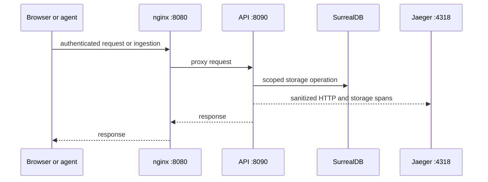

# OpenTelemetry and Jaeger

`docker compose up -d --build --wait` starts Jaeger 2.20.0 alongside the application. Its image is
pinned by digest. The UI is available at http://127.0.0.1:16686. OTLP HTTP (`4318`) is
reachable only inside Compose; the test override exposes loopback port `14318`.

API and worker configure the OpenTelemetry Go SDK through an Uber Fx lifecycle module.
`OTEL_SERVICE_NAME` identifies the process, and `OTEL_EXPORTER_OTLP_ENDPOINT` is the base
URL (Compose uses `http://jaeger:4318`). Shutdown flushes the bounded batch exporter.
Without an endpoint the tracer provider has no exporter.

Instrumentation covers HTTP requests, SurrealDB operations and leased job processing.
The job repository stores only W3C traceparent to connect enqueue and processing; arbitrary
baggage is not propagated. Database spans include database identity and failure class,
never SurrealQL or parameters. HTTP instrumentation receives a sanitized request without
query values, authorization headers or user-agent content; application handlers retain
their original request. Job spans contain ID, kind and fence, not job payloads.

Jaeger's all-in-one storage is ephemeral memory. Traces disappear on restart and are not
application records or a second persistent store. SurrealDB remains the only durable
application database. No permanent metrics/log storage is introduced by this increment.

Checks: a unit test inspects finished spans for query/credential leakage; a Compose
integration test exports a trace through OTLP and retrieves its trace ID through Jaeger's
query API. Both checks passed locally. Production sampling/retention and complete business
metrics remain release work; the current local sampler records every trace.

## Local verification

Start the base stack from the repository root, then check the proxy/API boundary
and the two instrumented processes:

```powershell
docker compose ps
docker compose logs --tail 100 api worker jaeger
Invoke-WebRequest http://127.0.0.1:8080/health
Invoke-WebRequest http://127.0.0.1:8080/readyz
```

On Linux use `curl -fsS` for the two URLs. `/health` is nginx's static health
response; `/readyz` reaches the API. After a web request or agent upload, open
<http://127.0.0.1:16686> and search for `valio-api` or `valio-worker`. A trace
appearing there proves local export for that operation; it does not prove complete
business metrics, retention, or production sampling.



Use `docker compose logs --tail 100 <service>` for startup or readiness failures.
Do not enable request-body logging to diagnose an upload: source and configuration
values are intentionally excluded from telemetry and should remain absent from logs.
The isolated integration stack has Jaeger UI `127.0.0.1:16687` and OTLP
`127.0.0.1:14318`; it leaves the base UI at 16686. See the
[development rules](development-rules.md) for its Compose command.
