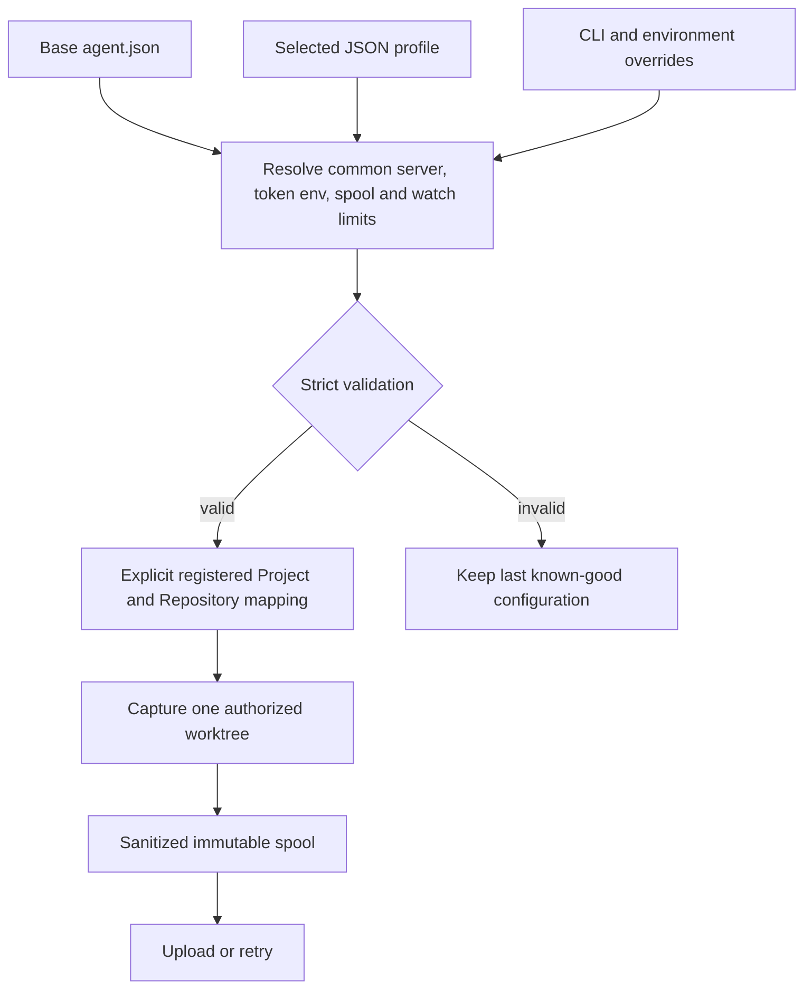

# Local agent configuration (proposed)

This document distinguishes the agent that exists today from a proposed file and
profile configuration model. No `agent.json`, profile loader, `--config`, or
`--profile` option is implemented yet.

## Current behavior

`valio-agent index` and `watch` accept these flags:

| Flag | Current meaning |
|---|---|
| `--root` | Git worktree root; defaults to the current directory. |
| `--output` | Write a sanitized snapshot JSON file instead of stdout. |
| `--spool` | Spool directory; defaults to `<root>/.valio/spool`. |
| `--interval` | Watch reconciliation interval; defaults to `2s`, minimum `100ms`. |
| `--max-file-bytes` | Source-file limit; defaults to and is capped at 2 MiB. |
| `--server` | Enables upload to this HTTPS or loopback-HTTP server. It is required for upload; there is no default server flag value. |
| `--workspace`, `--repository` | Upload destination IDs; default to `workspace-main` and `repo-main`. |

`resume` accepts `--spool`, `--id`, and the three upload flags. Without a server,
it validates and lists pending snapshots or emits one snapshot. `doctor` has no
configuration flags. `VALIO_API_TOKEN` is the only agent environment setting; it
overrides the built-in local token `valio-local-development-token-0001`. It is
sent only as a bearer credential. There is currently no project name, profile,
linked-project, source-root, or configuration-file support.

Capture resolves the worktree root, captures Git-tracked policy-accepted paths, and
does not turn local paths into server-side project definitions. A snapshot is retained
in the spool after upload for idempotent retry. One spool payload is limited to 64 MiB.
Source policy excludes configuration values, sensitive paths, and suspicious content
before spool, hashing, or upload; a configuration profile must never relax that policy.

## Proposed JSON model

Use JSON rather than YAML for the first implementation: Go can decode it with the
standard library, strict unknown-field validation is straightforward, and one
canonical encoding makes fixture and diagnostic behavior predictable. Each file
has an integer `schemaVersion`; an unsupported version fails before any filesystem
capture or network request.

`agent.json` is a machine-level base configuration. It holds shared connection and
local operational settings, not a project definition:

```json
{
  "schemaVersion": 1,
  "server": {
    "url": "http://127.0.0.1:8080",
    "tokenEnv": "VALIO_API_TOKEN"
  },
  "spool": { "path": "spool" },
  "watch": { "interval": "2s", "maxFileBytes": 2097152 },
  "profilesDirectory": "profiles"
}
```

The default base file is `%LOCALAPPDATA%\valio-code\agent.json` on Windows.
On Linux it is `$XDG_CONFIG_HOME/valio-code/agent.json`, or
`~/.config/valio-code/agent.json` when `XDG_CONFIG_HOME` is unset. A relative
`spool.path` and `profilesDirectory` are resolved from the base file's directory.
An explicit `--config` path is resolved from the invoking process's current
directory. The profile's `worktreeRoot` is always an absolute local path and is
validated as one; it is never resolved relative to either configuration file.

A selected profile describes one already registered target Project and its local
repository mappings:

```json
{
  "schemaVersion": 1,
  "name": "users-api",
  "workspaceId": "workspace-main",
  "project": { "id": "project-users-api", "name": "Users API" },
  "sources": [
    {
      "repositoryId": "repo-users",
      "worktreeRoot": "C:\\src\\users-api",
      "sourceRoots": ["services/api"]
    }
  ],
  "linkedProjects": [
    { "projectId": "project-billing", "name": "Billing", "scope": "context" }
  ]
}
```

`sourceRoots` express the Project's intended source selection, but current capture
still uploads a repository snapshot. The future resolver must verify that every
relative source root remains inside its declared worktree. A Project can have many
`sources`, and the same repository/source root can be attached to several Projects;
the profile does not collapse these server-side concepts.

## Resolution and safety rules

The proposed precedence is **CLI > environment > selected profile > base file >
built-in defaults**. CLI `--root`, `--server`, `--workspace`, and `--repository`
remain explicit overrides. Proposed environment overrides are `VALIO_AGENT_CONFIG`,
`VALIO_AGENT_PROFILE`, `VALIO_AGENT_SERVER`, and `VALIO_API_TOKEN`. A selected
profile may provide workspace, project, repository mappings, and source roots; it
must not override the global server URL or choose a different credential source.
Only the base file's `server.tokenEnv` chooses the environment variable containing
the token. Diagnostics name that variable but never show its value.

The proposed CLI is:

```text
valio-agent index --config path/to/agent.json --profile users-api
valio-agent watch --config path/to/agent.json --profile users-api
```

These commands are a design, not accepted current syntax. The resolved profile
must refer to pre-existing Workspace, Project, and Repository IDs. It must never
create a Project implicitly, upload a linked repository automatically, or capture
a path for which the selected source mapping provides no authorization. Register
repositories and create Projects through the explicit API/UI flow; attach the
mapping explicitly, then reindex the chosen source. If an attachment changes,
reindex creates a new immutable view rather than rewriting an old one.

`linkedProjects` supplies additional project scope for contextual retrieval only.
It is not a runtime, build, package, or compiler dependency fact, and it does not
authorize file access. Linked-project cycles are valid contextual relationships;
resolution uses a bounded visited set and depth/result limits. They must never be
rejected as compiler dependency cycles or traversed without limits.

For watch mode, parse and validate changed configuration atomically. Keep the last
known-good resolved configuration while a replacement is invalid, report a short
redacted diagnostic, and do not start a new capture from partial settings.
Cancellation applies between capture/upload operations. A configuration reload does
not cancel an in-flight immutable upload; the next reconciliation uses the new
valid configuration.

## Implementation backlog

1. Add versioned JSON models, a reader, strict validator, and redacted diagnostics.
2. Add a resolved-configuration service and explicit command/query selection path;
   keep command wiring in the CLI and capture/upload adapters outside the resolver.
3. Add explicit repository-to-project attachment and reindex handling; do not infer
   it from a local directory name or linked-project edge.
4. Add watch-safe reload and cancellation boundaries.
5. Add fixtures for Windows and Linux paths, precedence, schema versions, redaction,
   invalid/outside roots, multiple repositories/shared roots, linked-project cycles,
   and atomic last-good reload behavior.


