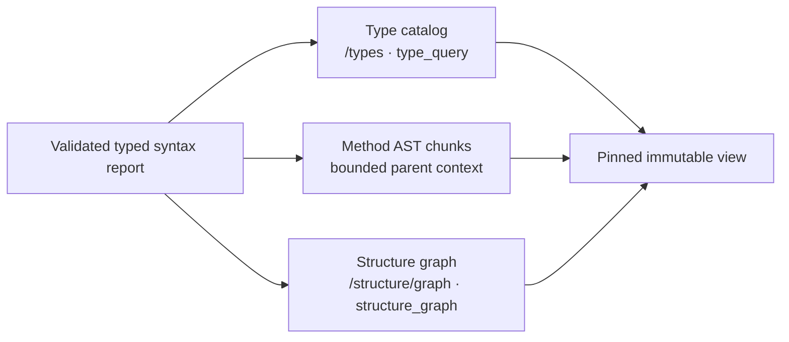

# Language analysis

`valio.code` records source-backed type and structure facts for Go, C, C++,
C#, Java, JavaScript, TypeScript, TSX and JSX in an immutable view. The result
is useful navigation evidence. It is not compiler output for the non-Go
languages.

## From syntax to a pinned view

The Tree-sitter helper produces a typed syntax report for each supported file.
Before it is used, the API validates the report schema, UTF-8 byte ranges,
declaration IDs, parent links and the required syntax-only capability. The same
validated report feeds the type catalog, method chunks and structure graph for
one pinned view.



This fan-out does not parse a current worktree during a read. A new upload
creates a new view; existing views retain their original evidence.

## Type catalog and structure graph

`GET /api/v1/types` and the MCP `type_query` tool read TypeDescriptors from Go
and the syntax adapters for C, C++, C#, Java, JavaScript and TypeScript,
including TSX/JSX where their host language applies. A descriptor can expose a
written class, struct, interface or enum; fields, properties, methods,
parameters, written return types, modifiers and visibility. Attribute lists are
kept as evidence-backed raw syntax. A C# enum's explicitly written underlying
type is retained.

`POST /api/v1/structure/graph` and MCP `structure_graph` expose declaration,
member and parameter containment. They also retain import and call observations
as explicitly unresolved. The graph answers where a written declaration sits in
the file; it does not prove what an import or a call resolves to.

## Supported paths

| Extension | Indexed language |
| --- | --- |
| `.c`, `.h` | C |
| `.cpp`, `.cc`, `.cxx`, `.hpp`, `.hxx`, `.hh` | C++ |
| `.cs` | C# |
| `.java` | Java |
| `.js`, `.mjs`, `.cjs`, `.jsx` | JavaScript; JSX for `.jsx` |
| `.ts`, `.mts`, `.cts`, `.tsx` | TypeScript; TSX for `.tsx` |

`.h` defaults to C because a header alone does not establish C++ language mode.
Other files remain source text and do not receive a syntax report.

## Boundaries

Go retains its partial local cross-file analysis through `go/types`; external
packages and every build-tag configuration are not guaranteed. The syntax
adapters for other languages do not resolve types, imports, aliases, overloads,
inheritance, cross-file calls, ABI/layout, CFG or data flow. Their symbol links
remain unresolved.

An enum expression such as `1 << 2` is preserved as a written expression. It
is not presented as an evaluated constant value. Missing generic information,
implicit enum values and physical layout remain unknown.

## Index and query a pinned view

Register a repository and project with its source root, then index an existing
Git worktree from the repository root:

```powershell
$env:VALIO_API_TOKEN = 'valio-local-development-token-0001'
go -C src/back-end run ./cmd/valio-agent index `
  --root C:\work\example `
  --server http://127.0.0.1:8080 `
  --repository example-repository
```

Keep the returned `viewId` for subsequent reads. `syntax_query` takes that same
scope and can filter by written name or file ID. The HTTP equivalent is
`POST /api/v1/syntax/query`; `GET /api/v1/types` and `type_query` now read the
multi-language descriptor catalog rather than a Go-only catalog.

## Enabling the native helper

Docker Compose includes Node and the helper dependencies. For a native API
process, install Node.js 26.8.1 and prepare the helper before API startup:

```powershell
Push-Location src/back-end/analyzers/syntax
npm ci
npm test
Pop-Location
$env:VALIO_SYNTAX_HELPER = (Resolve-Path src/back-end/analyzers/syntax/index.js).Path
$env:VALIO_NODE_BINARY = 'node'
go -C src/back-end run ./cmd/valio-api
```

The helper is configured at API startup. Its startup probe loads a grammar, so
a missing Node executable, incompatible grammar asset or unavailable helper
prevents the API from claiming syntax support. A helper failure during indexing
stops publication; parse diagnostics remain explicit in a stored partial report.
Reindex to add syntax facts to a new view; prior views are immutable.

## Verified checks

Windows passed `go test ./... -count=1` and `go vet ./...` with real SurrealDB
3.2.4 and Jaeger, including syntax integration. Docker built API, worker and
migration images and healthy Compose services. Linux Docker passed
`go test -race ./...`; database-dependent tests are skipped in that Linux build.

`scripts/smoke.ps1` passed seven rich user types, six non-Go structure graphs,
syntax search, Go graph reads, policy handling and idempotence. The smoke used
`qwen3-8b-lmstudio-docker` (Q8_0, 4096 dimensions), persisted 29 code embeddings
and ran semantic/hybrid retrieval in project `demo-6ebf95f8fc7e`, view
`7e6eddbb4543be8e0bb330ecd5ab65f81c6ce9cdf3b1019da69a767f52f7e93f`.
The earlier pinned view created with `87d2c0b` still returns one Go type candidate and five
lexical hits. These checks do not measure retrieval quality or establish
compiler semantics.

After smoke, reproduce live MCP/HTTP agreement with the project and view IDs in
the smoke receipt:

```powershell
$env:VALIO_TEST_API_URL = 'http://127.0.0.1:8080'
$env:VALIO_TEST_API_TOKEN = 'valio-local-development-token-0001'
$env:VALIO_TEST_PROJECT_ID = 'project-id-from-smoke-receipt'
$env:VALIO_TEST_VIEW_ID = 'view-id-from-smoke-receipt'
go -C src/back-end test ./internal/transport/mcp -run TestLiveHTTPMCPAgreement -count=1
```

The test compares `structure_graph`, `type_query`, `code_search`,
`retrieval_search` and `symbol_search`; optional MCP fields now use the same
defaults as HTTP.
