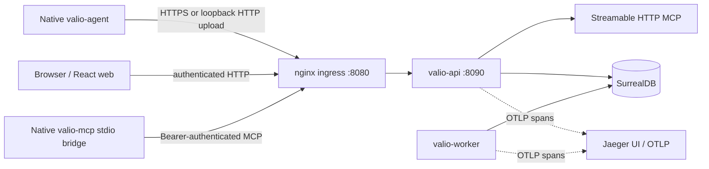
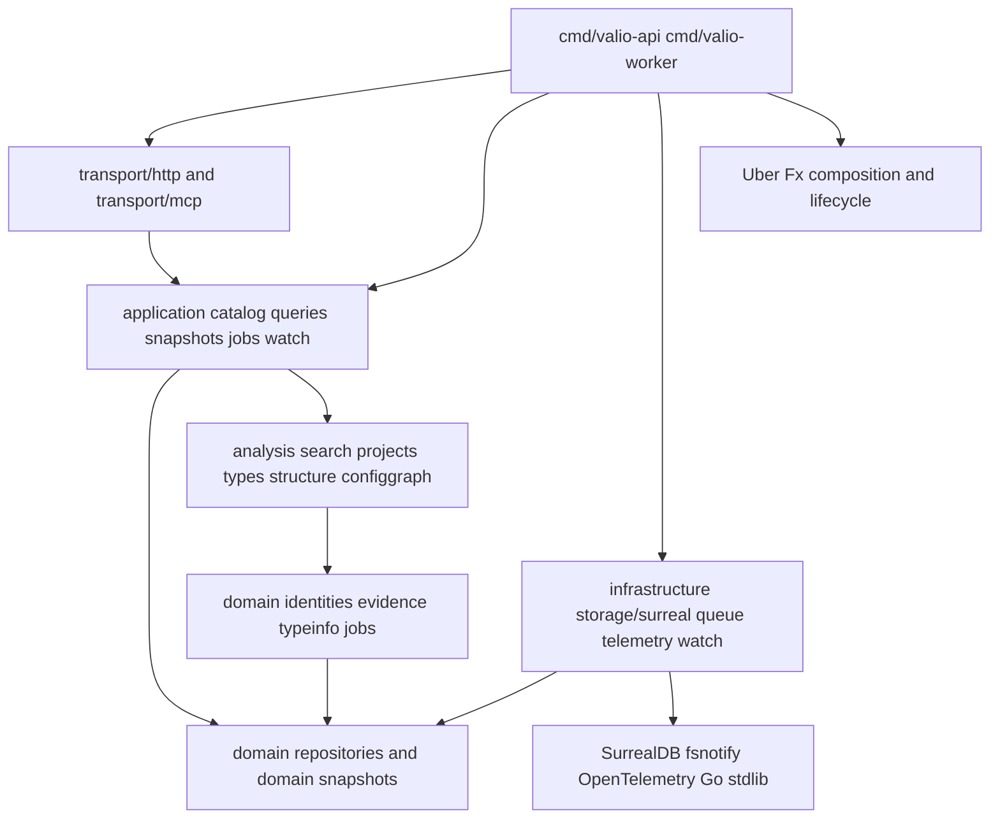
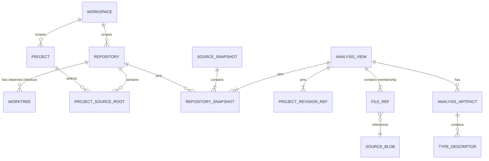
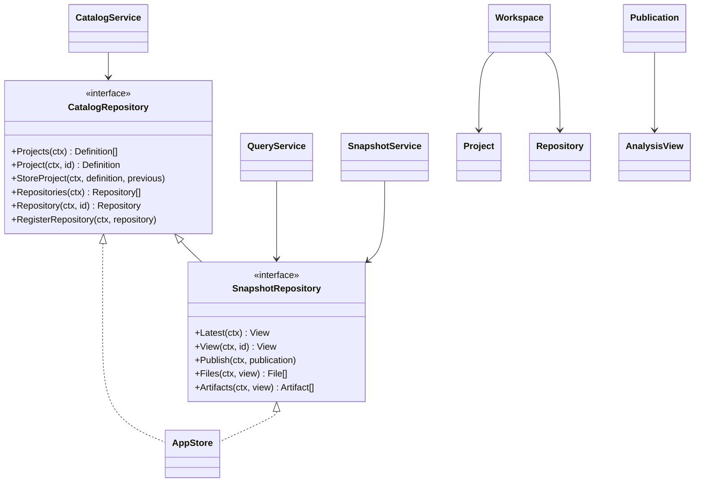
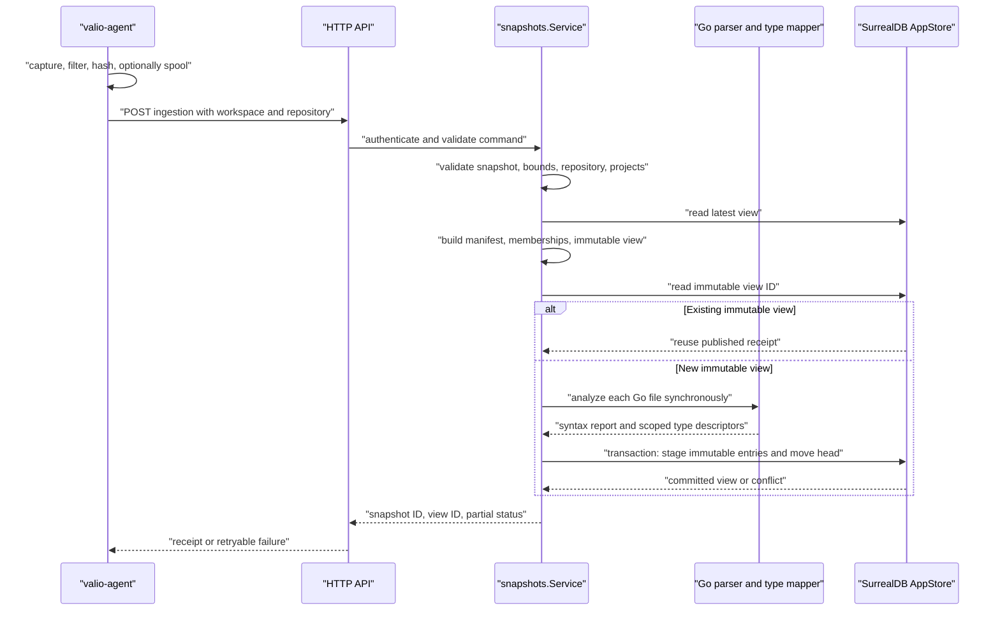
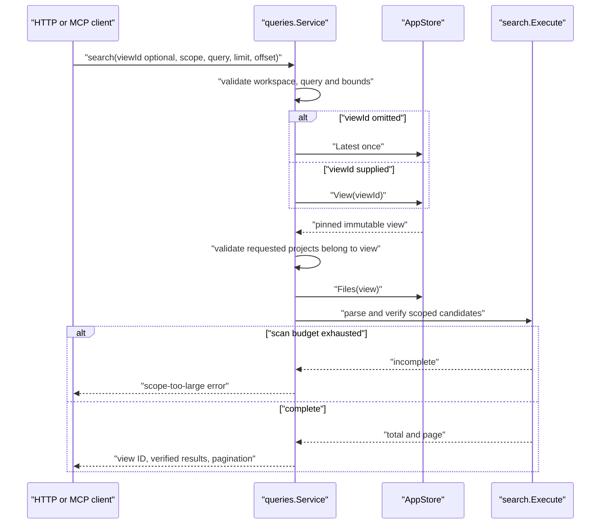
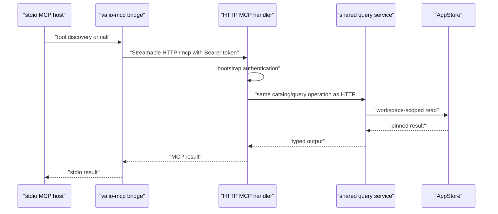
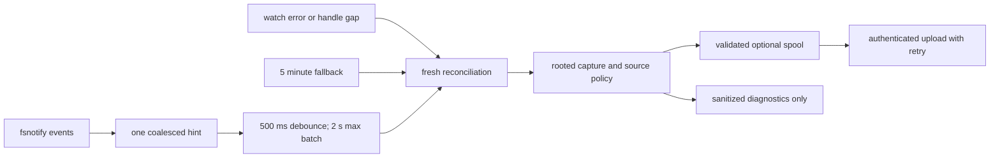
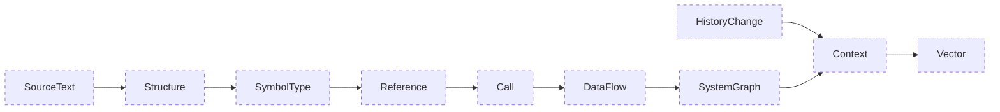

# Архитектура и границы компонентов

Этот документ описывает работающий локальный срез системы в репозитории. Он отдельно помечает запланированные границы. Наличие пакета, интерфейса или контракта проекции не доказывает, что соответствующий производитель уже реализован.

## Контекст текущей системы

`valio.code` — один модуль Go в [`src/back-end`](../../../src/back-end), с нативными исполняемыми командами, React/Vite-приложением в [`src/front-end`](../../../src/front-end) и SurrealDB как единственным постоянным хранилищем приложения. Project — сервис, библиотека, приложение или инструмент; Workspace — граница доступа; Repository — настроенный удалённый источник; Worktree — наблюдаемая локальная рабочая копия. Эти сущности намеренно различны. Project может включать несколько Repository, а Source Root может быть общим у нескольких Project.

Compose публикует на loopback только веб-вход `127.0.0.1:8080` и Jaeger `127.0.0.1:16686`. API слушает `8090` внутри внутренней сети. SurrealDB доступна только во внутренней сети Compose; нативные интеграционные тесты используют отдельное наложение конфигурации с loopback-портом `18000`. Compose запускает локальные namespace/database `valio` / `workspace_main` с одной общей конфигурацией `root` / `valio` для migrate, API и worker. Это намеренная конфигурация для локальной разработки, а не отдельные учётные записи служб. У Jaeger нет постоянного тома, поэтому трассы не сохраняются после остановки.

API создаёт один настроенный локальный Workspace (`workspace-main`). Domain поддерживает идентичности в пределах Workspace и несколько Repository/Source Root; роли нескольких пользователей и многопользовательская управляющая плоскость пока не реализованы.

## Направление зависимостей и композиция

Зависимости направлены внутрь. Пакеты Domain не импортируют HTTP, SurrealDB, Fx, файловую систему или SDK компилятора. Сервисы Application зависят от типизированных портов Domain. Infrastructure реализует порты и владеет вводом-выводом. Transports адаптируют HTTP и MCP к тем же сервисам Application. Command packages — корни композиции, а не место для прикладной логики.

[`cmd/valio-api/module.go`](../../../src/back-end/cmd/valio-api/module.go) через Fx создаёт один `surreal.Client`, `surreal.AppStore` в пределах Workspace, сервисы каталога, запросов и ingestion, начальную авторизацию, HTTP-адаптер и MCP-сервер. HTTP- и MCP-адаптеры получают один и тот же сервис хранилища и запросов. [`cmd/valio-worker/module.go`](../../../src/back-end/cmd/valio-worker/module.go) отдельно собирает worker с очередью и параллелизмом два. Его единственный зарегистрированный processor — `health`, выполняющий ping SurrealDB. Асинхронный processor анализа не подключён: анализ исходного кода выполняется синхронно во время ingestion.

Интерфейсы нужны на реальных границах: портах хранения, providers, источниках событий файловой системы, providers компилятора и processors заданий. Не создавайте Go interface, factory, visitor или `manager` только ради обёртки конкретного значения Domain. Для чистой проверки, преобразования, разбора, алгоритмов графа и builders предпочтительны небольшие structs с methods и package-level functions.

## Модель Domain и неизменяемые View

Связь Source Root со многими Project сделана намеренно. Root содержит Repository, относительный путь, include/exclude glob-шаблоны, роль, build unit и version. Принадлежность файлов определяется во время публикации, копируется в неизменяемый View и никогда не пересчитывается после последующего изменения Project.

Существенные инварианты определены в [`domain/model.go`](../../../src/back-end/internal/domain/model.go), [`projects/definition.go`](../../../src/back-end/internal/projects/definition.go) и [`domain/snapshots`](../../../src/back-end/internal/domain/snapshots):

- ID, Workspace и key Project неизменяемы при обновлении. Source Root обязан иметь Repository и version; include/exclude-шаблоны привязаны к root, нормализованы и проверены.
- Repository Snapshot закрепляет manifest fingerprint, а не изменяемое имя ветки. View закрепляет определения/ревизии Project, Repository Snapshot, исходные файлы и принадлежность. Смешанные снимки Repository помечаются явно.
- Evidence принадлежит View и содержит origin, assertion, resolution, полуоткрытый диапазон относительно Repository и явную кодировку позиций UTF-8/UTF-16.
- Идентичность Type включает Workspace, Project, build profile и версию View. Unknown layout, reference resolution и другие факты компилятора остаются unknown; они не заменяются нулём и не угадываются как exact.

Следующая class diagram использует реальные Go ports и service structs, не добавляя фиктивный объектный слой.

## Ingestion и атомарная публикация

Нативный agent создаёт очищенный снимок с адресацией по содержимому. Политика путей исключает небезопасные пути, symlinks, не обычные файлы, чувствительные имена и слишком большие файлы до чтения содержимого. После безопасного чтения проверяется бинарное содержимое и UTF-8, выполняются проекция конфигурации и фильтрация предполагаемых credentials — до хеширования содержимого, записи в spool или upload. Форматы конфигурации превращаются в безопасные проекции только с ключами; values никогда не входят в снимок исходного содержимого. Spool — журнал повторной доставки, не вторая база для поиска.

[`snapshots.Service.Ingest`](../../../src/back-end/internal/application/snapshots/service.go) проверяет недоверенный input до доступа к Repository или хеширования, ограничивает input 10 000 files и 16 MiB, определяет принадлежность файлам Project и создаёт Artifacts только для Go files. До разбора Artifacts и публикации сервис проверяет детерминированный View: точная повторная доставка использует существующую квитанцию. Server ingestion вызывает `analysis.Analyze`, поэтому собирает syntax facts; необязательная проверка одного файла через `go/types` не включена. [`surreal.AppStore.Publish`](../../../src/back-end/internal/infrastructure/storage/surreal/app_publication.go) в одной transaction проверяет expected head и текущие определения Project, принимает предварительно существующий immutable record только когда сохранённый payload совпадает, и сдвигает указатель latest View только вместе со всеми staged records. Одновременная публикация или изменение Project создаёт conflict вместо partial View. Дорогие capture и analysis происходят до transaction.

## Чтение закреплено за View и проверяется

Сервис запросов один раз разрешает отсутствующий ID View в `latest`, затем использует конкретный View во всём запросе. До чтения Source/Artifacts он проверяет область Workspace и принадлежность View. Search собирает источник-кандидат в памяти из сохранённых файлов, разбирает текстовое выражение, проверяет candidates по Source и возвращает ошибку, если лимит сканирования не позволяет получить полный результат. Это не постоянный FTS/HNSW и не семантический поиск.

`Search` принимает максимум 8 192 байта query, limit 1 000, неотрицательный offset и 128 ID Project. В данном развёртывании проверяется не более 10 000 files/16 MiB. `Types` читает только Artifacts закреплённого View и строит каталог в нужной области; неоднозначные candidates Type остаются раздельными. Реализованы MCP tools: `project_list`, `project_get`, `code_search`, `type_query`, `index_status`. Graph tools не публикуются.

## HTTP, MCP и локальная авторизация

HTTP-адаптер и Streamable HTTP MCP server используют одни и те же операции Application. Нативный `valio-mcp` — не второй client базы данных: он обнаруживает tools удалённого сервера, передаёт их arguments, добавляет bearer token, отклоняет redirects и разрешает non-HTTPS только для loopback. API выполняет проверку, авторизацию и разрешение View.

Локальный bootstrap authenticator хранит только token hash и создаёт временный ключ подписи session при startup. Browser sessions — HttpOnly, SameSite Strict cookies с восьмичасовым сроком; bearer requests принимаются для нативных clients. Небезопасные requests с cookie-authentication требуют разрешённый origin. Это намеренно один локальный principal, а не role-based access control.

## Долговечные Jobs и fencing

Jobs — долговечные записи с семантикой «как минимум один раз» в SurrealDB. Transactional claim назначает worker slot владельца, увеличивает fence token и число attempts, выдаёт lease на 60 секунд. Heartbeat, completion, failure и publication projection проверяют действующие owner/fence/lease перед mutation. Устаревший worker не может завершить или опубликовать результат после cancellation или потери lease.

```mermaid
stateDiagram-v2
  [*] --> queued: "enqueue or temporary retry"
  queued --> running: "transactional claim; fence plus one"
  running --> running: "heartbeat extends lease"
  running --> completed: "complete or fenced publish"
  running --> queued: "temporary failure; exponential delay"
  running --> failed: "permanent or retries exhausted"
  queued --> cancelled: "cancel"
  running --> cancelled: "cancel increments fence"
  running --> queued: "lease expires; another claim"
  completed --> [*]
  failed --> [*]
  cancelled --> [*]
```

Поддержанные переходы находятся в [`infrastructure/queue`](../../../src/back-end/internal/infrastructure/queue). Worker переводит неизвестный kind Job в окончательный `UNSUPPORTED_JOB`, а failure processor-а — во временный `HANDLER_FAILED` retry, пока attempts не превышают пять. Queue умеет атомарно публиковать generation head под lease, но producer Jobs для анализа/проекций пока не зарегистрирован: локальный worker запускает только `health` processor.

## Наблюдение, сверка и политика Source

`fsnotify` — источник подсказок. Он рекурсивно наблюдает обычные directories, не следует symlinks, пропускает `.git`, `.valio`, `.tools`, `node_modules` и ограничен 8 192 handles. Он не читает содержимое files. Сервис наблюдения объединяет signals, применяет задержку 500 ms, ограничивает batch двумя секундами, сразу запускает сверку после notification gap и выполняет её также каждые пять минут. Полный capture с применением policy остаётся источником истины.

Нельзя считать watcher event записью об изменении файла или считать отсутствие событий доказательством актуальности index. Нельзя логировать Source payloads, query text, credentials или configuration values на границах Application/Infrastructure. Policy путей применяется до reads, content/config filtering — до hashing, spool и upload. Если новый format способен раскрыть secret, его надо исключить до появления safe parser/projection.

## Предлагаемые Profiles и Projections пока не реализованы

В репозитории есть registry семейств Projection и несколько богатых контрактов. Это полезные ограничения для планирования, а не работающие возможности графа и векторов. В частности, сейчас отсутствуют постоянная graph projection, producer call/CFG/data-flow, vector/HNSW index, генерация семантического контекста, five-language SCIP pipeline, history analytics, API/SQL/event linker и asynchronous analysis worker.

Пунктирная схема — **предлагаемый контракт топологии** из registry, не рабочий поток данных. Будущие Profiles обязаны включать producer/version, входы Source/build, schema, evidence/completeness, output fingerprint, invalidation scope и cost limits. Выбор Profile не должен ослаблять policy Source или допускать content, исключённый capture. До выдачи graph result они должны быть интегрированы с immutable View. Текущий View ingestion отмечает `ready` только для Source Text, `partial` — для Symbols/Types; анализ Go на стороне сервера остаётся synchronous и syntax-led.

## Руководство по расширению

Использовать следующую маршрутизацию при добавлении возможности:

| Изменение | Место | Обязательная работа |
|---|---|---|
| Идентичность, инвариант, Evidence, долговечное значение или repository port | `internal/domain`, `internal/domain/typeinfo`, `internal/domain/snapshots`, `internal/domain/repositories` | Проверка и GoDoc; без HTTP, SurrealDB, Fx, compiler SDK или SQL imports. |
| Поведение Command/Query, проверки области без авторизации, ограниченная orchestration | `internal/application/<feature>` | Явные вход/выход, typed port, поведение при cancellation/budget, focused unit tests. |
| Parsing, чистый analysis, mapping, membership, manifest или search algorithm | focused package: `analysis`, `types`, `projects`, `search`, `structure` | Сохранять Evidence/Completeness; I/O за provider; fixtures для unknown и partial states. |
| SurrealDB query, queue lease, filesystem, Git, compiler process, telemetry или network provider | `internal/infrastructure/<adapter>` | Реализовать domain/application port, закрепить external dependencies, проверить adapter failure; SQL не собирается в services. |
| HTTP/MCP request/response/auth mapping | `internal/transport/http` или `internal/transport/mcp` | Использовать application service; проверять недоверенный input; не дублировать прикладные правила. |
| Связывание исполняемого приложения | `cmd/valio-api`, `cmd/valio-worker`, `cmd/valio-agent`, `cmd/valio-mcp` | Только Fx providers/lifecycle; при необходимости readiness и composition tests. |
| Поведение браузера | `src/front-end` | Использовать typed HTTP contract и показывать фактический ready/partial/unsupported state. |

Не добавляйте generic `GraphService`, `RepositoryManager`, class hierarchy, global service locator или transport-specific duplicate application operation. Новый interface нужен только при нескольких implementations, внешней границе I/O или значимой test seam. Имена database tables и SQL остаются в Surreal adapter; profile/version invariants — в Domain; retries/leases — в queue adapter; parser facts не смешиваются с compiler-resolved facts.

До признания нового persisted Projection или API готовыми нужно определить входные entities, выходные facts/projections, producer и Profile, invalidation unit, failure/partial states, query budgets, independent fixtures и cost/quality measurement. Diagram делает границу понятной для review, но не реализует planned component.
