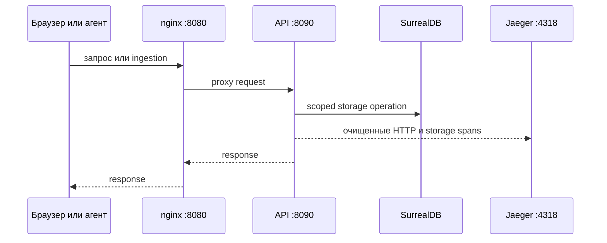

# Наблюдаемость

Compose запускает Jaeger 2.20.0. Интерфейс доступен на
<http://127.0.0.1:16686>; OTLP HTTP доступен только между контейнерами на
`jaeger:4318`. API и worker настраивают OpenTelemetry через lifecycle-модуль Fx
и завершаются с flush batch exporter.

Трассируются HTTP-запросы, операции SurrealDB и обработка арендованных задач.
В задаче хранится только W3C `traceparent`, чтобы связать постановку и обработку.
Спаны базы данных не содержат SurrealQL, параметры или учётные данные; HTTP-спаны
не содержат query-значения, заголовок Authorization или содержимое User-Agent.
Исходный текст и значения конфигурации не попадают в telemetry.

Хранилище Jaeger в локальном Compose является временным: трассы исчезают после
перезапуска и не заменяют SurrealDB. Постоянные метрики, политика sampling и
retention остаются задачами релиза. Подробная историческая запись проверок — в
английском [документе observability](../../en/contributing/observability.md).

## Локальная проверка

Запустите базовый стек из корня репозитория, затем проверьте proxy/API boundary и
два instrumented процесса:

```powershell
docker compose ps
docker compose logs --tail 100 api worker jaeger
Invoke-WebRequest http://127.0.0.1:8080/health
Invoke-WebRequest http://127.0.0.1:8080/readyz
```

В Linux используйте `curl -fsS` для обоих URL. `/health` — статический health
ответ nginx, `/readyz` доходит до API. После web request или agent upload откройте
<http://127.0.0.1:16686> и найдите `valio-api` или `valio-worker`. Появившийся
trace подтверждает локальный export этой операции, но не полноту метрик, retention
или production sampling.



При startup или readiness ошибке используйте `docker compose logs --tail 100
<service>`. Не включайте logging request body для диагностики upload: source и
configuration values намеренно исключены из telemetry и не должны попадать в логи.
У изолированного integration stack Jaeger UI `127.0.0.1:16687`, OTLP
`127.0.0.1:14318`; базовый UI остаётся на 16686. Compose-команда приведена в
[правилах разработки](development-rules.md).
