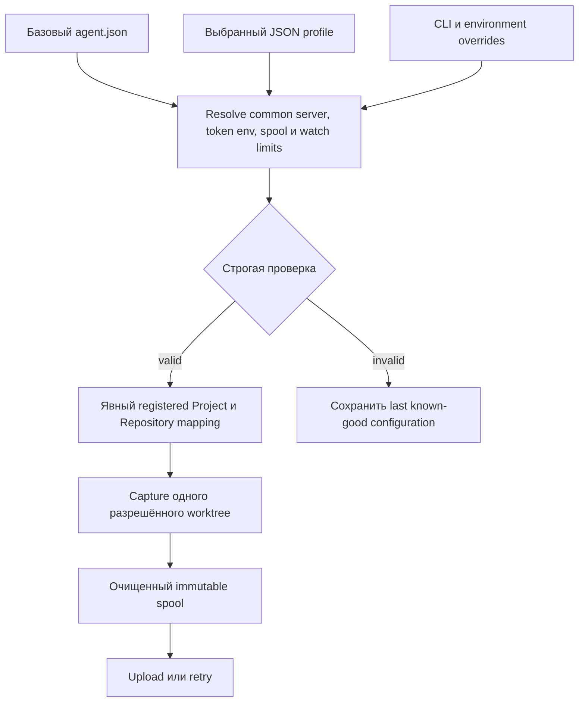

# Конфигурация локального агента (проектирование)

Документ отделяет текущее поведение агента от предлагаемой файловой модели. Файлы
`agent.json`, загрузчик профилей и флаги `--config`/`--profile` пока не реализованы.

## Что доступно сейчас

У `valio-agent index` и `watch` есть `--root` (worktree, по умолчанию текущий
каталог), `--output`, `--spool` (по умолчанию `<root>/.valio/spool`), `--interval`
(по умолчанию `2s`, минимум `100ms`), `--max-file-bytes` (не более 2 MiB),
`--server`, `--workspace` и `--repository`. Загрузка выполняется только при
явном `--server`; значения destination по умолчанию — `workspace-main` и
`repo-main`. `resume` принимает `--spool`, `--id` и флаги загрузки; `doctor`
настроек не имеет.

Единственная переменная окружения агента — `VALIO_API_TOKEN`: она заменяет
локальный токен `valio-local-development-token-0001`. Сейчас нет профилей,
проектных имён, linked projects, source roots или конфигурационных файлов.
Capture обрабатывает Git-tracked policy-accepted paths и не превращает локальные
пути в server-side project definitions. Snapshot остаётся в spool для идемпотентной
повторной отправки; один spool payload ограничен 64 MiB. Политика источников
исключает значения конфигурации, чувствительные пути и подозрительный текст до
spool, хеширования и загрузки. Профиль не может ослабить эту политику.

## Предлагаемая модель JSON

Для первого варианта выбран JSON: его декодирует стандартная библиотека Go, можно
строго отклонять неизвестные поля и получать единое представление fixtures. В
каждом файле есть целочисленный `schemaVersion`; неподдерживаемая версия завершается
до чтения worktree или сетевого запроса.

Базовый `agent.json` хранит общие настройки машины, а не описание проекта:

```json
{
  "schemaVersion": 1,
  "server": { "url": "http://127.0.0.1:8080", "tokenEnv": "VALIO_API_TOKEN" },
  "spool": { "path": "spool" },
  "watch": { "interval": "2s", "maxFileBytes": 2097152 },
  "profilesDirectory": "profiles"
}
```

Путь по умолчанию: `%LOCALAPPDATA%\valio-code\agent.json` в Windows;
`$XDG_CONFIG_HOME/valio-code/agent.json` в Linux, либо
`~/.config/valio-code/agent.json`. Относительные `spool.path` и
`profilesDirectory` считаются от каталога базового файла. Явный `--config`
считается от текущего каталога процесса. `worktreeRoot` профиля всегда абсолютный
локальный путь; относительные значения отклоняются.

Профиль выбирает уже зарегистрированный Project и локальные сопоставления
репозиториев:

```json
{
  "schemaVersion": 1,
  "name": "users-api",
  "workspaceId": "workspace-main",
  "project": { "id": "project-users-api", "name": "Users API" },
  "sources": [{
    "repositoryId": "repo-users",
    "worktreeRoot": "C:\\src\\users-api",
    "sourceRoots": ["services/api"]
  }],
  "linkedProjects": [{ "projectId": "project-billing", "name": "Billing", "scope": "context" }]
}
```

Будущий resolver проверяет, что каждый `sourceRoots` остаётся внутри своего
worktree. Один Project может содержать несколько `sources`; repository/source root
может быть общим между Projects. Профиль не объединяет эти разные серверные сущности.

## Правила разрешения и безопасности

Предлагаемый приоритет: **CLI > environment > выбранный профиль > базовый файл >
встроенные значения**. Существующие `--root`, `--server`, `--workspace` и
`--repository` остаются явными overrides. Предлагаемые environment overrides:
`VALIO_AGENT_CONFIG`, `VALIO_AGENT_PROFILE`, `VALIO_AGENT_SERVER` и
`VALIO_API_TOKEN`. Профиль задаёт workspace, Project и source mappings, но не
может менять общий URL сервера или источник учётных данных. Только
`server.tokenEnv` базового файла указывает имя переменной токена; диагностика
показывает имя, но никогда значение.

Предлагаемый, пока не реализованный, CLI:

```text
valio-agent index --config path/to/agent.json --profile users-api
valio-agent watch --config path/to/agent.json --profile users-api
```

Профиль обязан ссылаться на существующие Workspace, Project и Repository IDs. Он
не создаёт Project неявно, не загружает linked repository автоматически и не
захватывает путь вне выбранного source mapping. Репозиторий регистрируется, Project
создаётся, mapping прикрепляется явным действием API/UI, затем выполняется reindex.
Изменение attachment создаёт новый immutable view, а не переписывает старый.

`linkedProjects` добавляет только контекстную область retrieval. Это не факт
runtime/build/package/compiler зависимости и не разрешение на чтение файлов.
Циклы linked projects допустимы: обход использует ограниченные visited set,
глубину и число результатов. Их нельзя считать compiler cycles или обходить без
границ.

В watch mode новая конфигурация разбирается и проверяется атомарно. При ошибке
агент сохраняет last known-good resolved configuration, выдаёт короткую очищенную
диагностику и не начинает capture с частичными настройками. Cancellation действует
между capture/upload; reload не отменяет уже выполняющуюся неизменяемую загрузку.

## Backlog реализации

1. Версионные JSON-модели, reader, строгий validator и очищенная диагностика.
2. Сервис resolved configuration и явный путь command/query selection.
3. Явные repository-to-project attachments и reindex без вывода по имени каталога.
4. Безопасный reload/cancellation для watch.
5. Fixtures для путей Windows/Linux, приоритета, версий схемы, redaction, путей
   вне worktree, multi-repository/shared roots, циклов и atomic last-good reload.


