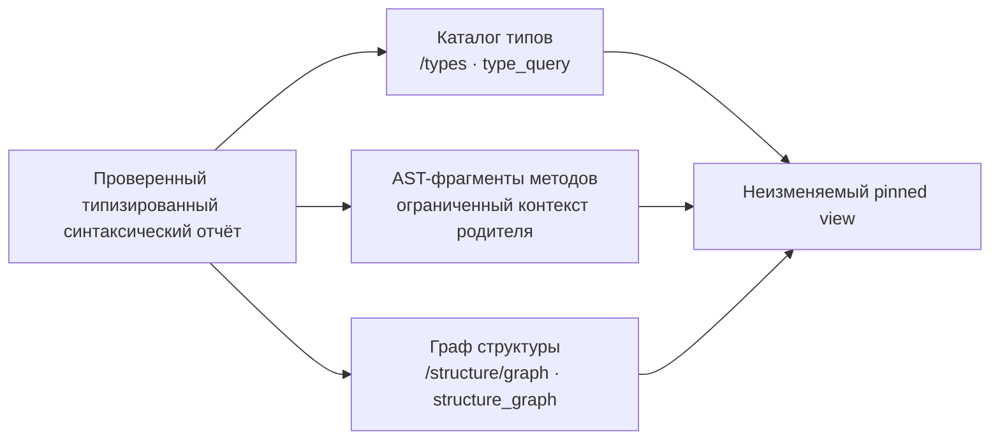

# Анализ языков

`valio.code` сохраняет привязанные к исходникам факты о типах и структуре для
Go, C, C++, C#, Java, JavaScript, TypeScript, TSX и JSX в неизменяемом view.
Это полезное свидетельство для навигации. Для не-Go языков оно не является
результатом работы компилятора.

## От синтаксиса к зафиксированному view

Tree-sitter helper создаёт типизированный синтаксический отчёт для каждого
поддерживаемого файла. До использования API проверяет его схему, диапазоны
байтов UTF-8, ID объявлений, родительские связи и обязательную возможность
только синтаксического анализа. Один проверенный отчёт питает каталог типов,
фрагменты методов и граф структуры в одном pinned view.



Этот поток не разбирает текущий worktree при чтении. Новая загрузка создаёт
новый view, а прежний сохраняет исходные свидетельства.

## Каталог типов и граф структуры

`GET /api/v1/types` и инструмент MCP `type_query` читают TypeDescriptor для Go
и синтаксических адаптеров C, C++, C#, Java, JavaScript и TypeScript, включая
TSX/JSX вместе с их основным языком. Описание может содержать написанные class,
struct, interface или enum, поля, свойства, методы, параметры, написанные типы
возврата, модификаторы и видимость. Списки атрибутов сохраняются как raw syntax
с evidence. У C# enum сохраняется явно написанный базовый тип.

`POST /api/v1/structure/graph` и MCP `structure_graph` выдают containment
объявлений, членов и параметров. Они также сохраняют наблюдения import и call с
явным состоянием unresolved. Граф показывает место написанного объявления в
файле, но не доказывает, во что разрешаются import или call.

## Поддерживаемые пути

| Расширение | Язык при индексации |
| --- | --- |
| `.c`, `.h` | C |
| `.cpp`, `.cc`, `.cxx`, `.hpp`, `.hxx`, `.hh` | C++ |
| `.cs` | C# |
| `.java` | Java |
| `.js`, `.mjs`, `.cjs`, `.jsx` | JavaScript; JSX для `.jsx` |
| `.ts`, `.mts`, `.cts`, `.tsx` | TypeScript; TSX для `.tsx` |

`.h` считается C, потому что по одному заголовку нельзя установить режим C++.
Остальные файлы остаются исходным текстом и не получают синтаксический отчёт.

## Границы

Go сохраняет частичный локальный межфайловый анализ через `go/types`; внешние
пакеты и все сочетания build tags не гарантируются. Синтаксические адаптеры
остальных языков не разрешают типы, imports, aliases, overloads, inheritance,
межфайловые calls, ABI/layout, CFG или поток данных. Их связи символов остаются
unresolved.

Выражение enum, например `1 << 2`, сохраняется как написанное выражение. Оно не
выдаётся за вычисленное константное значение. Отсутствующие generics, неявные
значения enum и физический layout остаются неизвестными.

## Индексация и запрос к pinned view

Зарегистрируйте репозиторий и project с его source root, затем проиндексируйте
существующий Git worktree из корня репозитория:

```powershell
$env:VALIO_API_TOKEN = 'valio-local-development-token-0001'
go -C src/back-end run ./cmd/valio-agent index `
  --root C:\work\example `
  --server http://127.0.0.1:8080 `
  --repository example-repository
```

Сохраните возвращённый `viewId` для следующих чтений. `syntax_query` принимает
тот же scope и умеет фильтровать по написанному имени или file ID. HTTP-аналог —
`POST /api/v1/syntax/query`; `GET /api/v1/types` и `type_query` теперь читают
многоязычный каталог descriptors, а не каталог только Go.

## Включение нативного helper

Docker Compose уже включает Node и зависимости helper. Для нативного API
установите Node.js 26.8.1 и подготовьте helper до запуска API:

```powershell
Push-Location src/back-end/analyzers/syntax
npm ci
npm test
Pop-Location
$env:VALIO_SYNTAX_HELPER = (Resolve-Path src/back-end/analyzers/syntax/index.js).Path
$env:VALIO_NODE_BINARY = 'node'
go -C src/back-end run ./cmd/valio-api
```

Helper настраивается при старте API. Startup probe загружает грамматику, поэтому
отсутствующий Node, несовместимый grammar asset или недоступный helper не дают
API заявлять поддержку syntax. Ошибка helper во время индексации останавливает
публикацию; diagnostics разбора остаются явными в сохранённом partial report.
Чтобы добавить syntax facts, проиндексируйте снова и создайте новый view: старые
views неизменяемы.

## Проверенные проверки

Windows прошёл `go test ./... -count=1` и `go vet ./...` с реальными SurrealDB
3.2.4 и Jaeger, включая syntax integration. Docker собрал API, worker и
migration images и healthy Compose-сервисы. Linux Docker прошёл
`go test -race ./...`; зависящие от базы тесты в этой Linux-сборке пропускаются.

`scripts/smoke.ps1` проверил семь описаний типа User, шесть графов объявлений
для языков помимо Go, поиск, чтения полей Go, фильтрацию конфигурации и
идемпотентность. Проверка использовала
`qwen3-8b-lmstudio-docker` (Q8_0, 4096 измерений), сохранил 29 code embeddings
и выполнил semantic/hybrid retrieval в проекте `demo-6ebf95f8fc7e`, view
`7e6eddbb4543be8e0bb330ecd5ab65f81c6ce9cdf3b1019da69a767f52f7e93f`.
Снимок, созданный версией `87d2c0b`, по-прежнему возвращает один Go-тип и пять
результатов лексического поиска. Эти проверки не измеряют качество поиска
и не подтверждают компиляторную семантику.

После запуска smoke воспроизведите проверку согласованности MCP и HTTP,
подставив идентификаторы проекта и снимка из результата скрипта:

```powershell
$env:VALIO_TEST_API_URL = 'http://127.0.0.1:8080'
$env:VALIO_TEST_API_TOKEN = 'valio-local-development-token-0001'
$env:VALIO_TEST_PROJECT_ID = 'project-id-from-smoke-receipt'
$env:VALIO_TEST_VIEW_ID = 'view-id-from-smoke-receipt'
go -C src/back-end test ./internal/transport/mcp -run TestLiveHTTPMCPAgreement -count=1
```

Тест сравнивает `structure_graph`, `type_query`, `code_search`,
`retrieval_search` и `symbol_search`; optional MCP fields теперь используют те
же defaults, что HTTP.
